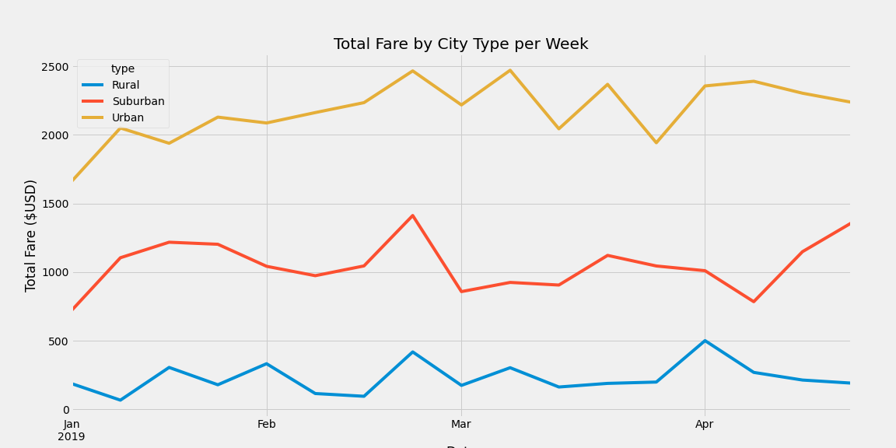
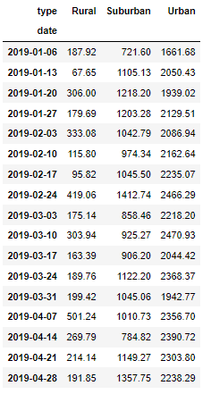
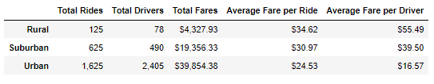

# PyBer Analysis  

## Project Overview  
In this analysis, we examined data from PyBer, a ride sharing app, and looked at trends across urban, suburban, and rural cities. Compiling the app data allowed us to calculate the total number of rides, total number of drivers, average fare per ride, average fare per driver, and total fare for each of the three city types during all of 2019. We then compared the total fare for each city on a given week, looking at the overall trend by city type from January 1, 2019 to April 28, 2019. 

## Resources 
- Data source: city_data.csv and ride_data.csv (included in this repository under the Resources folder)
- Software: Python 3.7.6, Pandas 1.2.4, NumPy 1.20.1, Jupyter Notebook 6.3.0, and Visual Studio Code 1.61.0

## Results  
By merging the City Data and Ride Data csv files, we were able to compile a single dataset of all rides taken and organize them by the city type. This allowed us to calculate the total fares for a given city type on any particular date. By organizing these fare sums by week, we get weekly fare totals for each city type, as seen in the chart below. A data frame is also supplied to find any exact value. 

  

  

For any given week, the total fares for urban cities is always greater than both suburban cities and rural cities, and the total fares for suburban cities is always greater than rural cities. That is, the lines on our chart never intersect, and each city type is consistent in terms of relative ranking for total fare. Rural cities never outrank the other two. 

That being said, the total fares do seem to follow a general trend, all spiking the last week in February and all decreasing the week of March 17. The variance in weekly fare is never enough to exceed another city type's weekly fare, and show upward or downward trends week-by-week with no noticeable overall increase or decrease (that is, often re-centering around an average and not showing a lasting change).  

In the following chart, we can examine other factors indicating the trends in PyBer rides among the three city types. 

  

We can see that the total fares for the entire year of 2019 match the trend seen in weekly fare from January to April, with urban cities pulling in the most fare and rural cities pulling in the least. There are also a number of rides and drivers expected for each city type, with more populous cities having more total drivers and more total rides. The average fare per ride and driver are inversely related to city size - smaller (rural) cities have higher average fares than larger (suburban and urban) cities do. 

While more populous cities generate higher total fare, less populous cities have higher average fare per ride and per driver. 

## Summary  
Based on this analysis, I recommend that V. Isualize considers the following suggestions to address the disparities seen across city types.

1. In order to increase total fares from rural cities, PyBer can advertise more in rural areas. This may increase the total number of rides taken in rural cities. As rural cities tend to have the highest average fare per ride, this can greatly increase PyBer's revenue, as an average rural ride has a higher fare than an average urban ride.  
2. V. Isualize can increase the fare for urban rides. Urban rides have the lowest fare per ride and fare per driver, but the highest number of total rides. Revenue can be greatly increased by increasing the fare for urban cities (but she needs to keep a balance to not increase the fare so much that the total number of rides will decrease).
3. The total number of rides correlates with the total number of drivers. That is, cities with more drivers have more rides. Rural city drivers are taking an average of 1.6 trips, while urban drivers are taking an average of 0.7 trips each. (This is found by dividing the total rides by total drivers for each city type.) Perhaps by increasing the number of drivers in rural cities, there will be more total rides taken. V. Isualize can attempt to hire additional drivers in less populated areas to increase the total number of rides in those cities. 